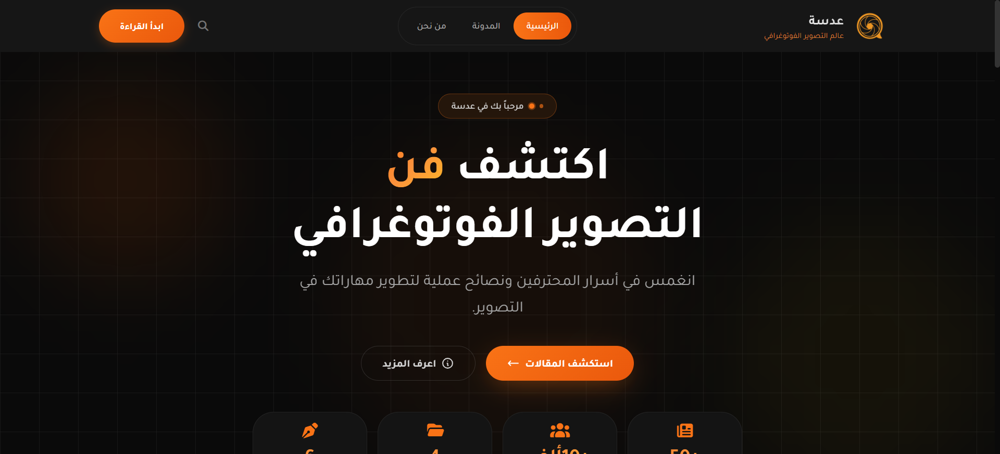

# 📸 Adasa — عدسة

Adasa is a responsive Arabic photography blog built using Angular.  
The website presents photography articles, categories, author details, and individual blog pages through a modern dark-themed interface.

## 🔗 Live Demo

[View Live Website](https://adasa-15x6.vercel.app/home)

## 🖼️ Project Preview



## ✨ Features

- Fully responsive design
- Arabic RTL layout
- Modern dark user interface
- Blog posts filtering by category
- Pagination between blog posts
- Dynamic blog details using article slugs
- Reusable Angular components
- Angular routing between pages
- Lazy loading for selected components
- Custom 404 Not Found page
- Privacy Policy and Terms pages

## 📄 Pages

- Home
- Blog
- Blog Details
- About Us
- Privacy Policy
- Terms and Conditions
- 404 Error Page

## 🛠️ Technologies Used

- Angular
- TypeScript
- HTML5
- CSS3
- Angular Router
- Bootstrap
- Vercel

## 🚀 Run the Project Locally

Clone the repository:

```bash
git clone https://github.com/nada-mahrous/Adasa.git
```

Open the project directory:

```bash
cd Adasa
```

Install the required packages:

```bash
npm install
```

Run the development server:

```bash
ng serve
```

Open the following address in your browser:

```text
http://localhost:4200
```

## 📦 Build the Project

To create a production build, run:

```bash
ng build
```

The generated files will be available inside the `dist` directory.

## 📁 Project Structure

```text
Adasa/
├── public/
├── src/
│   ├── app/
│   │   ├── components/
│   │   │   ├── blog/
│   │   │   ├── blog-details/
│   │   │   ├── error/
│   │   │   ├── footer/
│   │   │   ├── home/
│   │   │   ├── nav/
│   │   │   ├── privacy/
│   │   │   ├── terms/
│   │   │   └── whous/
│   │   ├── app.routes.ts
│   │   ├── posts-data.ts
│   │   └── posts.ts
│   ├── index.html
│   ├── main.ts
│   └── styles.css
├── Preview.PNG
├── angular.json
├── package.json
└── README.md
```

## 👩‍💻 Author

Developed by **Nada Mahrous**.
